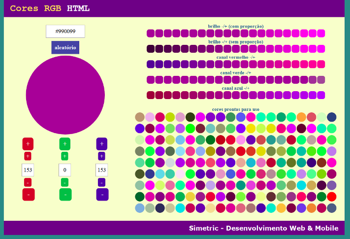

# HTML Color Helper
> Webapp to help me choose RGB colors. 


I use this app locally to help me to find a nice RGB combination to my applications.

## Technologies utilized
* HTML5
* JavaScript
* CSS3

## Public area


## Installation

Any Operating System:

```sh
git clone https://github.com/diemeslen0/color.git
```

## Release History

* 0.0.1
    * Initial release beta

## Meta

Diemesleno Souza Carvalho – [@diemesleno](https://twitter.com/diemesleno) – diemesleno@gmail.com

Distributed under the ![AUR][gpl-image] license. 

[https://github.com/diemeslen0/simetric](https://github.com/diemeslen0/)
